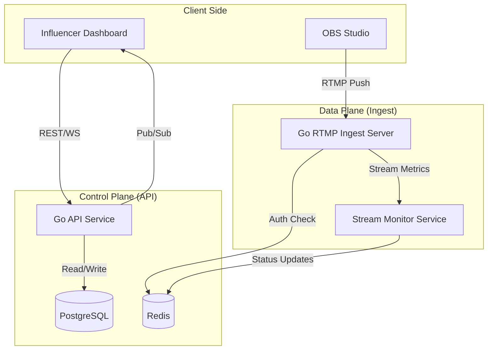

# Design Document: stream-sync

## Overview

**stream-sync** is a high-performance live streaming infrastructure built with Go. The system is architected to separate the **Control Plane** (management of credentials, user settings, and metadata) from the **Data Plane** (the ingestion and processing of RTMP video streams). 

The core philosophy leverages Go’s first-class concurrency primitives (goroutines and channels) to handle thousands of concurrent RTMP connections with minimal overhead. To ensure low latency and high availability, the system utilizes a distributed locking mechanism to prevent duplicate stream sessions and a real-time event bus to propagate stream status changes to the influencer's dashboard.

---

## Architecture

The system follows a microservices-inspired architecture but can be deployed as a modular monolith for initial scaling.



### Architectural Decisions
1.  **RTMP Protocol Handling**: Handled by a custom Go implementation or a high-performance library (e.g., `joy4` or `pili-live/go-rtmp`) using goroutines per connection.
2.  **State Management**: Redis is used for session locking (Requirement 2.3) and as a Pub/Sub mechanism for real-time dashboard updates (Requirement 3.1).
3.  **Security**: Stream keys are generated using `crypto/rand` to ensure cryptographic security (Requirement 1.2).

---

## Components and Interfaces

### Component 1: Credential Manager (Control Plane)

**Responsibilities:**
- Generating and rotating cryptographically secure stream keys.
- Managing RTMP Ingest URLs based on regional availability.
- Providing masked/unmasked views for the UI.

**Interfaces:**
```typescript
interface CredentialService {
  /** Generates a new cryptographically secure stream key */
  generateStreamKey(userId: string): Promise<StreamCredential>;
  
  /** Invalidates existing key and creates a new one */
  resetStreamKey(userId: string): Promise<StreamCredential>;
  
  /** Retrieves the Ingest URL for the specific user's region */
  getIngestUrl(userId: string): string;
}

interface StreamCredential {
  userId: string;
  streamKey: string; // Plaintext for DB/Internal
  ingestUrl: string;
  createdAt: Date;
}
```

### Component 2: RTMP Ingest Server (Data Plane)

**Responsibilities:**
- Handling TCP handshakes and RTMP protocol negotiation.
- Authenticating incoming streams against the Stream Key store.
- Enforcing the "Single Connection" lock per Stream Key.
- Extracting metadata (Resolution, Bitrate) from video packets.

**Interfaces:**
```typescript
interface IngestServer {
  /** Validates the stream key via internal cache/DB */
  authenticate(streamKey: string): boolean;
  
  /** Initializes connection and starts a Go routine for the stream */
  handleConnection(conn: RTMPConnection): void;
  
  /** Emits metadata for monitoring */
  onMetaData(streamId: string, meta: StreamMetadata): void;
}

interface StreamMetadata {
  bitrate: number;
  width: number;
  height: number;
  fps: number;
}
```

### Component 3: Stream Monitor & Status Service

**Responsibilities:**
- Updating channel status to "Live" or "Offline".
- Aggregating real-time metrics for the dashboard.
- Handling graceful timeouts for connection drops.

**Interfaces:**
```typescript
interface StatusService {
  /** Updates status in DB and broadcasts to UI via WebSockets */
  updateStatus(streamId: string, status: "LIVE" | "OFFLINE"): void;
  
  /** Logs connection metadata for auditing */
  logSession(metrics: SessionLog): void;
}
```

---

## Data Models

### Database Schema (PostgreSQL)
```typescript
interface UserChannel {
  id: string;
  userId: string;
  streamKeyHash: string; // Store hash for security, not plaintext
  isLive: boolean;
  lastLiveAt: Date;
  ingestServerId: string;
}

interface StreamSession {
  id: string;
  channelId: string;
  ipAddress: string;
  startedAt: Date;
  bitrateKbps: number;
  resolution: string;
}
```

### Cache Model (Redis)
- **Key:** `lock:stream:{streamKey}` | **Value:** `connectionId` (TTL set to stream duration)
- **Key:** `status:{userId}` | **Value:** `{"status": "live", "bitrate": 4500}`

---

## Logic Flows

### Stream Authentication Flow (Go Backend)
1. OBS Studio initiates connection to `rtmp://ingest.stream-sync.io/live/{streamKey}`.
2. The Go RTMP server accepts the TCP connection.
3. The server checks Redis for the key `lock:stream:{streamKey}`.
    - If exists: Reject (Requirement 2.3: Lock concurrent connections).
    - If not: Authenticate against DB/Cache.
4. On success:
    - Set Redis lock.
    - Spawn a goroutine to pipe the stream.
    - Trigger `updateStatus("LIVE")` (Requirement 3.1).

### Status Monitoring Flow
- **Bitrate Calculation**: The Go backend samples the byte count processed by the goroutine every second.
- **Resolution**: Extracted from the RTMP `onMetaData` packet sent by OBS.
- **Disconnect**: If the socket closes or the context is cancelled, the server waits 10 seconds (Requirement 3.3) before marking the stream "Offline" to account for minor network jitters.

---

## Error Handling

| Scenario | System Response | Requirement Ref |
| :--- | :--- | :--- |
| Invalid Stream Key | RTMP Handshake fails; "Unauthorized" logged. | Req 2.2 |
| Duplicate Connection | Reject second connection; Keep first active. | Req 2.3 |
| Capacity Exceeded | Redirect to Edge Node or return "Service Unavailable". | Req 5.2 |
| Clipboard Failure | Frontend triggers fallback notification. | Req 4.3 |

---

## Testing Strategy

### 1. Unit Testing (Go)
- **Credential Generation**: Test `crypto/rand` output for collision resistance and alphanumeric constraints.
- **Authentication Logic**: Mock DB/Cache to test key validation and masking logic.

### 2. Integration Testing
- **RTMP Handshake**: Use a mock RTMP client to simulate connections with valid/invalid keys.
- **Concurrency Test**: Use Go's `race` detector and simulate 1,000+ simultaneous connections to verify goroutine stability.

### 3. Load Testing
- **Capacity Testing**: Stress test the ingest server to determine the maximum number of concurrent streams per CPU core.
- **Latency Testing**: Measure the time between "Stream Start" in OBS and "Live" status update in the Dashboard (Goal: < 2s).

### 4. Frontend E2E Testing
- Test the "Copy to Clipboard" functionality across different browsers.
- Verify that the Stream Key is masked by default in the DOM.